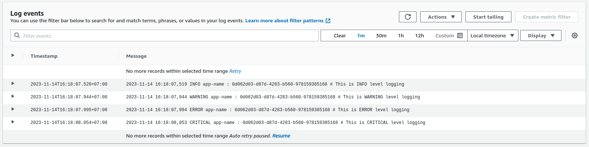

# Correlation logger
Production-ready logging library for Python. 
The logs are published in the log sinks.  At present two types of 
log output/sink is supported

1) Console 
2) AWS cloudwatch logs

It supports correlation ids or salt to perform detail tracing of the events.

## How To Use

1. Install dependency

```
pip install correlation-logger
```

2. Use module

```py
import logging
import uuid
from correlation_logger.logger import Logger, LogSink

correlation_id = str(uuid.uuid4())
log = Logger(name="app-name",
             log_sink=LogSink.CONSOLE,
             log_level=logging.INFO)

log.info("This is INFO level logging", correlation_id)
log.warning("This is WARNING level logging", correlation_id)
log.error("This is ERROR level logging", correlation_id)
log.critical("This is CRITICAL level logging", correlation_id)
log.debug("This is DEBUG level logging", correlation_id)
```

Output:

```
(env) $ python test.py 
2023-11-14 15:39:24,703 INFO app-name : 71ad28cc-ce5c-4324-b635-dbd73e8d4c12 # This is INFO level logging
2023-11-14 15:39:24,703 WARNING app-name : 71ad28cc-ce5c-4324-b635-dbd73e8d4c12 # This is WARNING level logging
2023-11-14 15:39:24,703 ERROR app-name : 71ad28cc-ce5c-4324-b635-dbd73e8d4c12 # This is ERROR level logging
2023-11-14 15:39:24,703 CRITICAL app-name : 71ad28cc-ce5c-4324-b635-dbd73e8d4c12 # This is CRITICAL level logging
```

### Cloudwatch logging

If we want to store the log in AWS Cloudwatch, we can pass `CloudWatchHandler` object
to `Logger` like the following:

```python
import logging
import uuid
from correlation_logger.logger import Logger, LogSink, CloudWatchHandler

correlation_id = str(uuid.uuid4())
cloudwatch_handler = CloudWatchHandler(level=logging.INFO, # Set logging level
                                       region_name="ap-southeast-1",
                                       aws_access_key_id="access_key",
                                       aws_secret_access_key="secret_key",
                                       log_group_name="cloudwatch_group",
                                       log_stream_name="stream_name")
log = Logger(name="app-name",
             log_sink=LogSink.CLOUDWATCH, # Use LogSink.CLOUDWATCH
             log_level=logging.INFO,
             cloudwatch_handler=cloudwatch_handler) # Pass cloudwatch_handler here

log.info("This is INFO level logging", correlation_id)
log.warning("This is WARNING level logging", correlation_id)
log.error("This is ERROR level logging", correlation_id)
log.critical("This is CRITICAL level logging", correlation_id)
log.debug("This is DEBUG level logging", correlation_id)
```

When we run the code, we will not see any log output in the terminal since 
all the logs are sent to Cloudwatch. If we open the cloudwatch log stream,
we'll see an output like this



## Development

If you want to develop this module you can fork this 
repository to push your code, then create a pull request to
this repository.

### To build project
`poetry build`

### To test project
`poetry run pytest`

